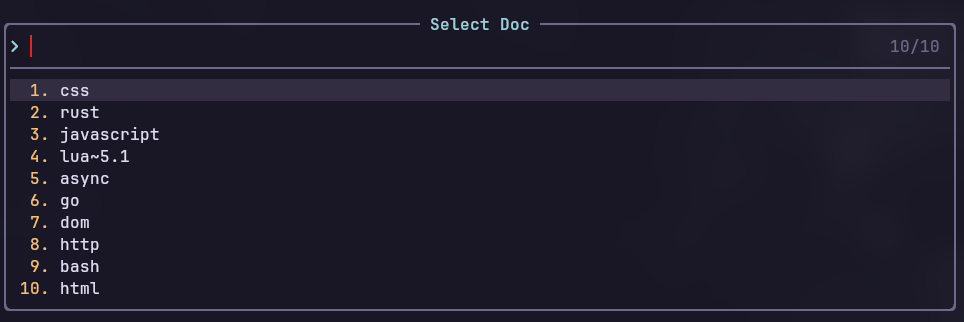
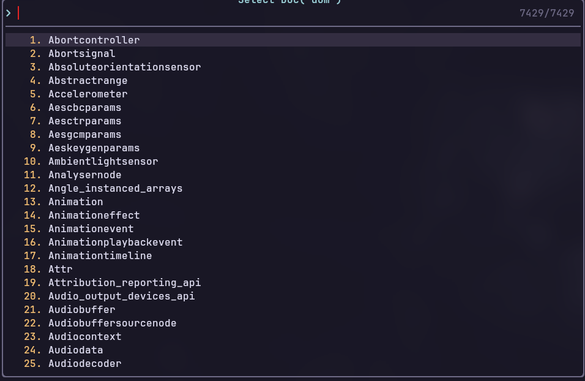

# Devdocs.nvim

A [devdocs](https://devdocs.io) client





## Installation

- `jq`, `curl` and `pandoc` are required dependencies

```lua
  {
     "maskudo/devdocs.nvim",
    lazy = false,
    keys = {
      {
        "<leader>ho",
        mode = "n",
        "<cmd>DevDocs get<cr>",
        desc = "Get Devdocs",
      },
      {
        "<leader>hi",
        mode = "n",
        "<cmd>DevDocs install<cr>",
        desc = "Install Devdocs",
      },
    },
    opts = {
      ensure_installed = {
        "go",
        "html",
        -- "dom",
        "http",
        -- "css",
        -- "javascript",
        "lua~5.1",
        -- "rust",
      },
    },
  },
```

## Commands

- `DevDocs fetch`: Fetch devdocs metadata
- `DevDocs get <doc>`: Get all docs or get `<doc>`
- `DevDocs install <doc>`: Show all installable doc or install `<doc>`

## License MIT
