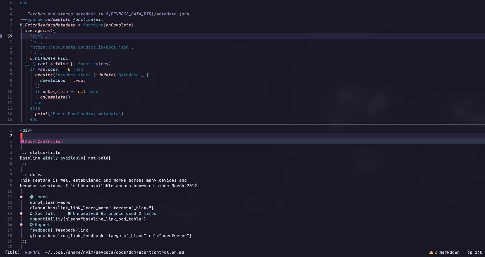

# Devdocs.nvim

A [devdocs](https://devdocs.io) client




## Installation

- `jq`, `curl` and `pandoc` are required dependencies

```lua
  {
     "maskudo/devdocs.nvim",
    lazy = false,
    dependencies = {
      "folke/snacks.nvim",
    },
    cmd = { "DevDocs" },
    keys = {
      {
        "<leader>ho",
        mode = "n",
        "<cmd>DevDocs get<cr>",
        desc = "Get Devdocs",
      },
      {
        "<leader>hi",
        mode = "n",
        "<cmd>DevDocs install<cr>",
        desc = "Install Devdocs",
      },
      {
        "<leader>hv",
        mode = "n",
        function()
          local devdocs = require("devdocs")
          local installedDocs = devdocs.GetInstalledDocs()
          vim.ui.select(installedDocs, {}, function(selected)
            if not selected then
              return
            end
            local docDir = devdocs.GetDocDir(selected)
            -- prettify the filename as you wish
            Snacks.picker.files({ cwd = docDir })
          end)
        end,
        desc = "Get Devdocs",
      },
      {
        "<leader>hd",
        mode = "n",
        "<cmd>DevDocs delete<cr>",
        desc = "Delete Devdoc",
      }
    },
    opts = {
      ensure_installed = {
        "go",
        "html",
        -- "dom",
        "http",
        -- "css",
        -- "javascript",
        -- "rust",
        -- some docs such as lua require version number along with the language name
        -- check `DevDocs install` to view the actual names of the docs
        "lua~5.1",
        -- "openjdk~21"
      },
    },
  },
```

## Commands

- `DevDocs fetch`: Fetch devdocs metadata
- `DevDocs get <doc>`: Get all docs or get `<doc>`
- `DevDocs install <doc>`: Show all installable doc or install `<doc>`
- `DevDocs delete <doc>`: Delete installed doc `<doc>`

> NOTE: When first run, the docs configured in `ensure_installed` will download in the background.
> Until they are downloaded and unpacked initially hitting <leader>hv will result in an empty selection.

## License MIT
